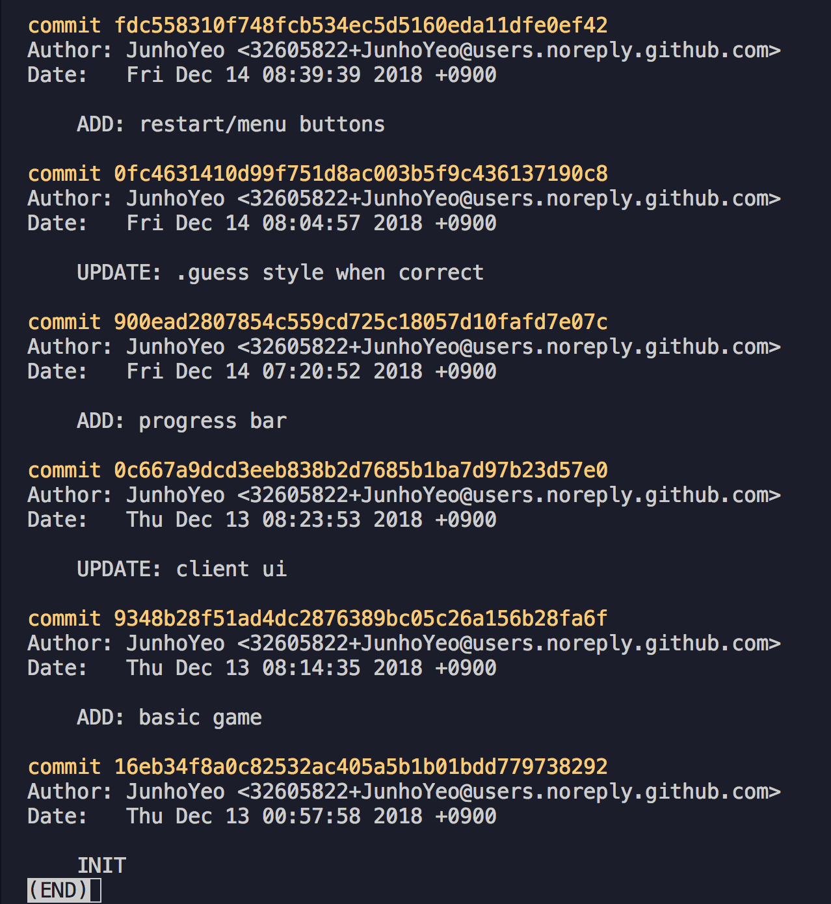

# 001. Github
전 세계의 개발자들이 코드와 프로젝트를 공유하는 Github에 대해서 알아봅시다.

## 프롤로그
아마 이전에 프로젝트를 해본 분들도 계실 거예요. 꼭 개발이 아니더라도요.

보통 개발이나 영상이나 뭘 만들게 되면 보통 처음에 노가다해서 조금씩 만들고 또 수정하고 또 추가하고, 그러다가 지우는 부분도 있고... (무한반복) 하면서 원하는 결과물에 다가가게 됩니다.

그런데 하다 보면 `아씨 이거 왜 추가했지? 미운데?` 라던가 `이전 버전으로 돌릴 걸 그랬어ㅜㅜ` 같은 생각이 나오게 됩니다.

그러니까 약간 예시를 쉽게 들자면(*준호피셜 주의*), 저는 어릴 때 레고를 좋아했는데요(물론 밟으면 기분이 나빴습니다).

> 어느 날, 준호는 레고로 멋진 우주선을 만들었어요!
> 
> 그런데 우주선의 디자인이 뭔가 부족한 듯 싶어서 블록을 추가하기로 했어요.
> 
> 준호: `허걱쓰,,, 추가했더니 더 이상해진 것 같아...`
> 
> 준호: `이전 버전으로 돌리고 싶다!`
> 
> 그러나 유감스럽게도 준호는 블록을 추가하기 전의 우주선이 어떻게 생겼는지 **기억나지 않았어요.**
> 
> 결국 준호는 우주선을 다시 뜯어고쳐야 했답니다.

허걱! 내 우주선, ㅜ.ㅜ

그래서 보통은 이렇게 생각했을 수도 있어요. `와! 버전별로 폴더를 만들어서 뭐가 바뀔 때마다 이렇게 해야겠어!`

그런데 이게 여간 귀찮은 게 아닙니다(경험담). 새로운 폴더를 만드는 백업 주기를 정하는 것도 어렵고요.

게다가 몇 가지 문제점이 더 생겼어요.

> 상윤이는 준호의 끔찍한 우주선을 멀리서 처다보고 있었어요.
> 
> 상윤: `아니;; 어떻게 저렇게 흉측한 우주선을 만들 수 있지!`
> 
> 상윤이는 준호에게 참교육을 시전하기로 했어요.
> 
> 상윤: `준호야 나랑 같이 만들지 않을래?`
> 
> 준호: `헉 상윤아 고마워,,, 역시 너밖에 없어!`
> 
> 상윤: `하하! 계획 성공!`
> 
> 그렇게 준호와 상윤이는 **협업**을 진행하게 되었어요.
> 
> 그런데, 문제가 발생했답니다.
> 
> 준호: `와 여기에 이 블록을 놓아야겠다.`
> 
> 상윤: `여기에 이걸 놓으면 좀 엘레강스틱해 보이겠는걸!`
> 
> `(쾅! 내가 놓을 거야 저리 비켜)`하고 **충돌** 발생
> 
> 헉! 여러 명의 사람들이 한 프로젝트를 하다 보니 서로 생각도 다르고, 진행하는 부분도 달라서 충돌이 발생했어요.
> 
> 그렇게 우주선 프로젝트는 망하는 걸까요!

그리고 몇 가지 문제가 더 있었으니...

> 다행히도 결국 우주선은 살아남았어요. 
> 
> 나린: `와 뭐야뭐야 나도 우주선 만들기 할래`
> 
> 상윤: `그래 나린아 내가 끼워 줄게`
> 
> 나린: `그..그래;; 정말 고마워`
> 
> 그날 밤이였어요.
> 
> 준호: `(우주선을 살펴본다) 엥... 구... 구르기? ㄱ... 감자 미사일?`
> 
> 준호: `뭐야 누가 우주선에 이런 이상한 기능들을 만든 거야!`
> 
> 나린: `헉 난 아니야! 아마 상윤이가 아닐까?`
> 
> 상윤: `? 가.. 갑자기..? 나도 아니야!`

우리 친구들은 누가 그랬는지 알 것 같나요? (온화한 웃음)

프로젝트를 여러 사람들이 진행하면서 생길 수 있는 이런 문제들을 해결해 주기 위해서 나온 것이 바로 `git`이랍니다.

그럼, 우리 `git`에 대해서 더 알아볼까요? (두구두구 효과음)

## 1. git의 탄생
`리눅스마스터`라는 자격증이 있어요. 이걸 따면 디미고 입학 가산점이 무려 1점입니다! ~~근데 저는 이게 없었어요~~

우리 모두 지망생의 순수한 마음으로 돌아가 보면 `리눅스? 이게 뭔데 1점이나 주는 거지? 한글이랑 좀 다른가?`라고 생각해 볼 수 있을 거예요. 리눅스는 `리누스 토르발스`라는 사람이 만든 운영체제예요. 약간 윈도우 같은 거라고 생각하면 됩니다.

근데 이게 오픈소스라서, 누구나 코드를 읽고 수정하고 쓸 수 있게 공개되어 있어요. 그래서 사람들이 `헐 뭐야 나도나도` → `오예 나 이제 리눅스에 기여한거야(자부심 레벨 업)` → `와;; 너 좀 쩌는데? 나도 해보고 싶다`, 이런 식으로 점점 기능을 추가해 나가면서 막강해진 거예요. 그리고 이런 이유로 다른 비싼 운영체제와 다르게 가격도 무료고, 사람들이 좋아하다 보니 파생된 버전도 많고 하다 보니 서버 쪽에서는 많이 쓰인답니다.

리누스도 처음에 우리의 우주선 프로젝트처럼 기여한 사람들이 보내는 이메일 리스트로 나름 버전 관리를 하다가 점점 복잡해지니 `BitKeeper`라는 상용 프로그램을 사용하게 됩니다. 그런데 BitKeeper 측이 무료 제공을 중단, 리눅스 커뮤니티와 갈등이 생기게 되면서 결국 직접 만들어 쓰기로 결정합니다.

그리고 2주만에 `git`이라는 버전 관리 프로그램을 만들었습니다. 갓누스...

우리 시바들도 불편한 게 있으면 직접 2주만에 만들어 쓰는 사람이 되자고요! 와!

## 2. 그래서 git이란
`git`은 분산형 소스코드 버전 관리 시스템이예요.

> 희대의 망작, [디미워드](https://github.com/CIVAR-DIMIGO/Dimiwords)의 git 로그 

먼저 실제 코드가 저장되는 중앙 서버(원격 저장소-`remote server`)가 존재합니다. 여기에 여러 개의 컴퓨터들이 연결됩니다.

각각의 컴퓨터는 작업한 내용을 스테이지(`stage`)에 올려서 로컬 저장소에 커밋(`commit`)합니다. 

그 다음 커밋들을 푸시(`push`)해서 원격 저장소에 올립니다.

이와 반대로 다른 컴퓨터가 작업한 내용을 풀(`pull`)해서 변경 사항을 로컬 저장소로 동기화할 수 있어요.

이번에도 재미있는 예시를 통해서 설명해 볼게요.

> 준호와 친구들은 우주선 프로젝트에 git을 사용하기로 했어요.
> 
> 준호는 `spaceship.c` 파일을 새로 생성하고, 기존의 `space.txt` 파일 맨 끝에 `><` 문자를 추가했어요.
> 
> 준호: `와! 오늘도 힘들게 우주선을 코딩했는걸! ^~^ 역시 피시방은 개발하는 장소라고!`
> 
> **[system] 준호는 `git add .` 명령어를 이용해서 현재 변경사항을 스테이징했다!**
> 
> 준호: `이제 지금 스테이징된 수정 내용을 하나의 업데이트 단위(???)로 등록해야겠어!`
> 
> **[system] 준호는 `git commit -m "우주선 파일 업데이트"` 명령어를 입력했다!**
> 
> **[system] "우주선 파일 업데이트"라는 커밋이 생겼다!**
> 
> 준호: `작업을 좀 더 하고 몇 가지 커밋을 더 해야겠어.`
> 
> (...)
> 
> 준호: `헉헉 다했다. 이제 다른 친구들이 수정 사항을 확인할 수 있도록 원격 저장소에 올려야겠어.`
> 
> **[system] 준호는 `git push` 명령어를 이용해서 원격 저장소에 커밋들을 올렸다!**
> 
> 한편 매우 중요한 비즈니스 때문에 지구 반대편에 있던 상윤이...
> 
> 상윤: `혹시라도 변경 사항이 더 생겼나 확인해 봐야겠는걸.`
> 
> **[system] 상윤이는 `git pull` 명령어를 입력했다!**
> 
> 상윤: `오~!! 준호가 작업한 "우주선 파일 업데이트"라는 이름의 작업이 새로 들어왔네!`
> 
> 상윤이는 그렇게 노동을 했다고 합니다.

아무튼 이런 거예요.

그런데, 이상한 명령어를 쓰면서 하니까 왠지 조금 어려워 보이네요? 

걱정하지 마세요. 우리에게는 `Github Desktop`이라는 쩌는 GUI 프로그램이 있었으니... ~~어차피 나중에 다 배우게 되긴 하겠지만~~
 
## 3. Github 그리고 Github Desktop

## 더 알아보기
나중에 작업 예정입니다.

- `Pull Request` (PR, 풀 리퀘스트)
- `Issue` (이슈)
- `Branch` (브랜치)
- `Git CLI`
  