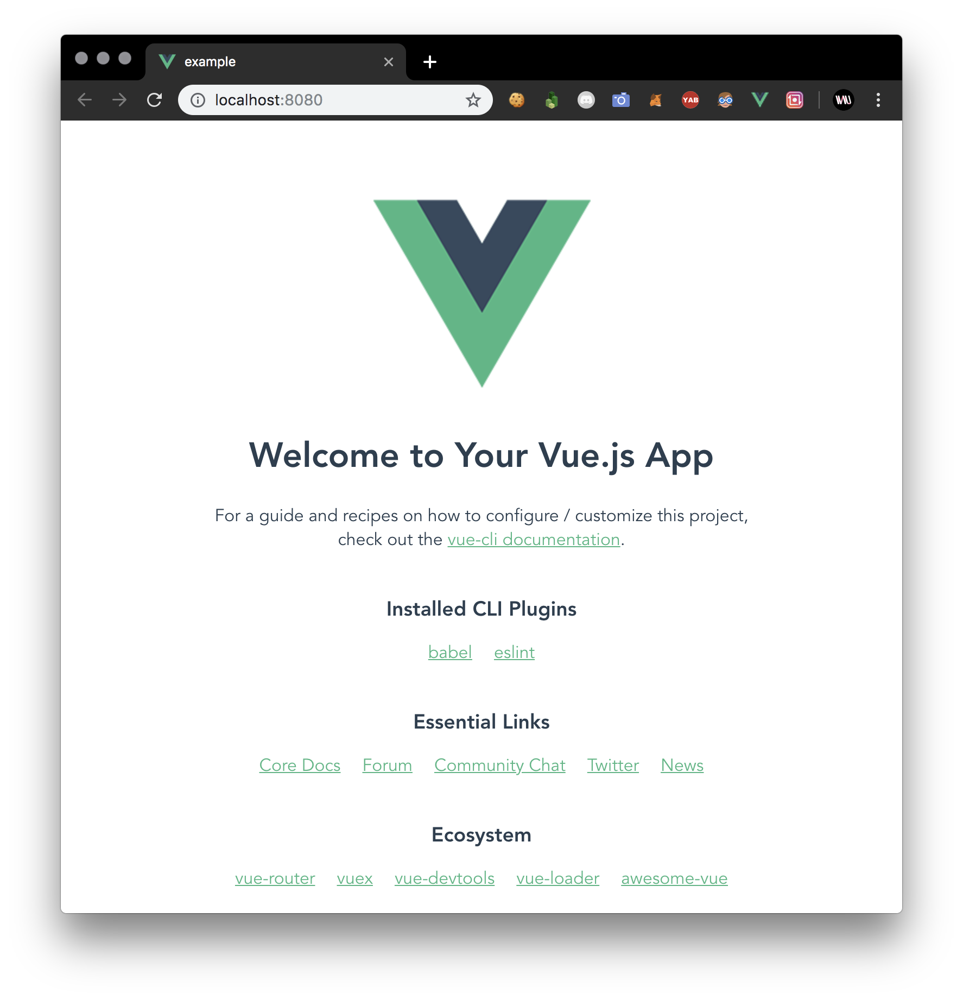

# 003. Vue.js
프론트엔드 과제가 생각보다 심각해서 준비했습니다. Vue.js로 간단한 프로젝트를 만드는 강의입니다.

모든 내용은 Windows 10 기준으로 진행하겠습니다.

## 1. Node.js, NPM 설치

### 설치
윈도우에서는 아마 NPM(npm package manager)까지 같이 깔릴 거예요.

- [nodejs.org](https://nodejs.org/en/)에 가서 최신 버전의 Node.js를 설치해주세요.
  - LTS로 깔아도 되고 걍 최신으로 깔아도 돼요.
- 인스톨러가 나오면 아는 거 빼고 걍 다 `Next`랑 `Install` 같은 긍정적인 느낌의 단어만 눌러주시면 됩니다.
- 제대로 쭉쭉 누르셨다면 NPM도 깔리고, PATH에도 설치 위치가 추가될 겁니다.

### Node.js: 설치 확인
1. CMD를 열어주세요. 윈도우 키를 누르고 `cmd` 치면 나와요.
2. `node -v`하면 아마 `v11.9.0` 같은 형식의 버전이 표시될 거예요. 그러면 `node`가 제대로 설치된 거예요.

### NPM: 설치 확인
마찬가지로 `npm -v`를 실행하면 `6.9.0` 같은 NPM 버전이 나올 거예요. 그럼 제대로 된 거임.

### 여담
NPM 말고 Yarn이라는 패키지 매니저도 있으니까 참고하세요.

## 2. Vue CLI 설치

### NPM으로 설치

```bash
npm install -g @vue/cli
```

Vue CLI 3을 설치해주세요. 3.X 버전이 이미 2018년에 나왔는데도 대부분의 강의가 2.X 버전을 다루고 있어요. 제발 3으로 해주세요.
 
저거 골뱅이 안 붙이면 2로 깔리니까 주의하세요.

## 설치 확인
설치가 완료되고 `vue -V`를 실행해서 버전을 확인할 수 있어요.

## 3. Vue 프로젝트 만들기
먼저 CMD를 열고 `cd` 명령어를 이용해서 프로젝트 폴더를 위치시킬 곳으로 이동해주세요. 이건 검색하면 진짜 바로 나옵니다.

```bash
vue create example
```

`example`이라는 새로운 앱을 생성하겠습니다.

```bash
Vue CLI v3.4.0
┌───────────────────────────┐
│  Update available: 3.7.0  │
└───────────────────────────┘
? Please pick a preset: (Use arrow keys)
❯ default (babel, eslint) 
  Manually select features 
```

아마 설정(프리셋)을 고르라고 하는 이런 인터페이스가 나타날 건데요. 일단은 그냥 `default`로 가보겠습니다.

```bash
(...)
⚓  Running completion hooks...

📄  Generating README.md...

🎉  Successfully created project example.
👉  Get started with the following commands:

 $ cd example
 $ npm run serve
```

프로젝트 생성이 완료되면 위와 같은 내용이 나오네요.

현재 폴더에서 `cd example`로 생성된 `example` 폴더로 들어가 주세요.

```bash
 DONE  Compiled successfully in 3349ms                                                                                 오후 4:35:52

 
  App running at:
  - Local:   http://localhost:8080/ 
  - Network: http://172.18.0.240:8080/

  Note that the development build is not optimized.
  To create a production build, run npm run build.
```

`npm run serve`를 실행하면 위처럼 로컬 서버가 돌아갈 거예요. [http://localhost:8080/](http://localhost:8080/)로 가주세요.



> 와! 드디어!

이런 창이 뜨면 일단 성공입니다. 이제 Vue 프로젝트의 구조랑 문법을 다뤄볼게요.

## 4. Vue 파일 살펴보기: 컴포넌트란?
먼저 `src/` 폴더 안의 `App.vue` 파일을 살펴봅시다.

```html
<template>
  <div id="app">
    
    <HelloWorld msg="Welcome to Your Vue.js App"/>
  </div>
</template>

<script>
import HelloWorld from './components/HelloWorld.vue'

export default {
  name: 'app',
  components: {
    HelloWorld
  }
}
</script>
```

기본적인 HTML 지식이 있다면 위 코드를 쉽게 이해할 수 있을 거예요.

- 먼저 `script` 부분이 먼저 실행됩니다.
  - `./components/HelloWorld.vue`에서 `HelloWorld` 컴포넌트를 가져와 등록합니다.
- `template`는 실제로 렌더링되는 부분입니다.
  - `img` 태그로 `./assets/logo.png`의 로고를 보여줍니다.
  - `HelloWorld` 컴포넌트를 불러오고, prop인 `msg`로 문자열 `Welcome to Your Vue.js App`를 전달합니다.

### 컴포넌트의 prop
그렇다면 주어진 경로로 가서 `HelloWorld.vue` 파일을 살펴볼까요?

```html
<template>
  <div class="hello">
    <h1>{{ msg }}</h1>
    <p>이하 생략...</p>
  </div>
</template>

<script>
export default {
  name: 'HelloWorld',
  props: {
    msg: String
  }
}
</script>
```

**prop** 은 Vue 컴포넌트가 부모 컴포넌트(자신을 사용하는 템플릿의 컴포넌트)에게 전달받는 값입니다.

- `props`를 통해 `HelloWorld` 컴포넌트가 부모 컴포넌트로부터 String(문자열) 타입의 `msg`라는 데이터를 받아온다는 것을 알 수 있습니다.
- 템플릿에서는 `{{ msg }}`로 `msg` 값을 출력합니다. 중괄호로 값을 감싸는 이 태그 문법은 **JSX 문법** 이라고 합니다.

#### prop의 타입
잠깐, String 타입의 prop을 받는다고 정의했다면, 다른 타입도 있는 걸까요?

맞아요! prop은 문자열 외에도 모든 자바스크립트의 데이터 타입이 될 수 있어요.

```html
<!-- some component -->
<script>
export default {
  name: 'Test',
  props: {
    num: {
      type: Number
    }
  }
}
</script>

<template>
  <div class="test">
    {{ num * 5}}
  </div>
</template>

<!-- some parent component -->
<test :num="500" />

<!-- result -->
2500
```

이때 `Number`, `Object`, `Boolean`, `Function` 등등이 될 수 있답니다.

단, `String`이 아닌 타입의 prop을 전달할 때는 아래처럼 `v-bind` 디렉티브를 사용하거나 그 약어로 `:`를 prop 이름 앞에 붙여 줘야 한답니다.

```html
<!-- Boolean type data를 전달 -->
<test v-bind:data="true" />
<test :data="true" />
```

### 컴포넌트를 사용하는 이유
대체 컴포넌트를 왜 사용하는 것일까요?

**컴포넌트** 는 `a`, `p`, `div` 같은 기존의 HTML 엘리먼트를 확장하여 재사용 가능한 코드를 쓸 수 있게 해 줍니다.

예를 들어서 아래와 같은 HTML이 있다고 생각해 봅시다.

```html
<div class="list">
  <div class="item">
    <div class="profile">
      <span class="name">오준서</span>
      <span class="comment">안녕 난 오준서!</span>
    </div>
  </div>
  <div class="item">
    <div class="profile">
      <span class="name">심재성</span>
      <span class="comment">안녕 난 심재성!</span>
    </div>
  </div>
  <div class="item">
    <div class="profile">
      <span class="name">장종우</span>
      <span class="comment">안녕 난 장종우!</span>
    </div>
  </div>
</div>
```

잘 살펴보면 `item` 클래스를 가진 같은 `div` 코드가 이름과 인사말만 바뀐 채 계속 반복된다는 것을 알 수 있습니다. 
들여쓰기 덕분에 알아보기는 어렵지 않지만, 정작 이들이 차별화되는 중요한 데이터(이름과 인사말)는 눈에 잘 띄지 않고, 약간 어지럽기도 하네요.

그리고 이런 코드 중복이 그리 효율적인 것 같지는 것 같죠?

```html
<!-- ./components/Item.vue -->
<script>
export default {
  name: 'Item',
  props: {
    name: {
      type: String,
      default: '이름 없음'
    },
    comment: {
      type: String,
      default: '인사말 없음'
    }
  }
}
</script>

<template>
  <div class="item">
    <div class="profile">
      <span class="name">{{ name }}</span>
      <span class="comment">{{ comment }}</span>
    </div>
  </div>
</template>

<!-- App.vue -->
<script>
import Item from './components/Item.vue'

export default {
  components: {
    Item
  }
}
</script>

<template>
  <div class="list">
    <item name="오준서" comment="안녕 난 오준서!" />
    <item name="심재성" comment="안녕 난 심재성!" />
    <item name="장종우" comment="안녕 난 장종우!" />
  </div>
</template>
```
> ~~그냥 v-for를 씁시다~~ ~~이건 나중에 말씀드릴게요~~
> 
이처럼 컴포넌트를 사용하면 가독성 문제도 해결할 수 있고, 코드 중복도 줄일 수 있답니다.

앗, 그리고 눈치챘겠지만 컴포넌트 역시 `App.vue` 같은 구조를 가지는 **Vue 인스턴스** 랍니다!
